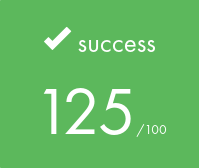
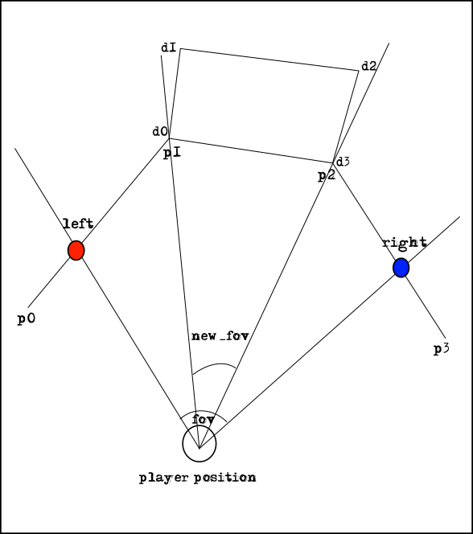
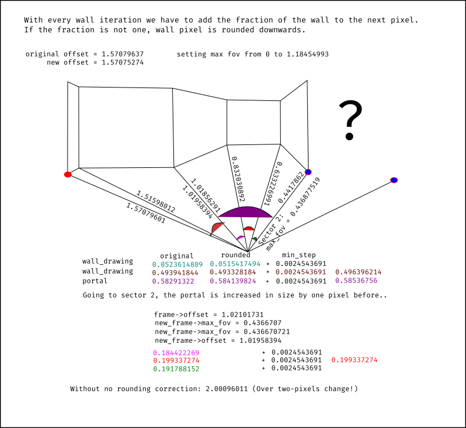

# wolf3d

Our Hive Helsinki school graphics branch project, where our goal was to create a maze where player can move using arrow keys using raycaster technique. We paired up with [kafkalainen](https://github.com/kafkalainen) in January to use the engine in later project as well.

## Usage
- In Windows environment, you have to install MingW gcc compiler for Windows.
Download the installer from https://sourceforge.net/projects/mingw/files/Installer/
This project assumes that it is installed to C:\MinGW
- In Linux environment you will need `gcc` compiler to be installed, and also the packages SDL2 needs to compile.
However, these are not included in the makefile, as user should install these under their own discretion.

		sudo apt-get update
		sudo apt-get install build-essential git make cmake autoconf automake \
		libtool pkg-config libasound2-dev libpulse-dev libaudio-dev libjack-dev \
		libx11-dev libxext-dev libxrandr-dev libxcursor-dev libxfixes-dev libxi-dev \
		libxinerama-dev libxxf86vm-dev libxss-dev libgl1-mesa-dev libdbus-1-dev \
		libudev-dev libgles2-mesa-dev libegl1-mesa-dev libibus-1.0-dev \
		fcitx-libs-dev libsamplerate0-dev libsndio-dev libwayland-dev \
		libxkbcommon-dev libdrm-dev libgbm-dev

- Run `make` in the root to compile the program.
- Run maps by piping them to program. ie.
	`./wolf3d map_files/circle_map.TEST`

## Maps

Data has been formatted in the map in following way.

	#wolf3d_sectors#1
	#sector0	4	0	10	-5	-4	-100,100,-1	-100,-100,-4	100,-100,2	100,100,-4
tag | explanation
----|---------
#wolf3d_sectors | program id
#1 | number of sectors
#sector0 | sector followed by it's index.
4 | number of walls
0 | floor height
10 | ceiling height
-5 | floor colour
-4 | ceiling colour
-100,100,-1 | x and y coordinate, and index. Negative integers are textures, positive integers are portals.

## Engine features
- 2.5D engine completely written from scratch.
- Running at 90-120 FPS using just software acceleration.
- Perspective correct texture mapping in walls.
- Graphics function only lighting up the pixel in the screen and managing input events through SDL2 library.
- Music and sounds through SDL_Mixer library 🎵🎶
- XPM parser for the textures.
- Map files as xy coordinates, walls
can be in any direction.
- Player has wall collisions.
- Minimap.
- Wireframe drawing.

## Learned through project
- Linear algebra.
- Vertex manipulation.
- To use dot product and cross product to determine direction of rays and lines.
- Rays, linesegments, normals and lines.
- Convex space and polygons.
- Sector based map design.
- Portal based occlusion technique.
- Raycasting in 1992 Wolfenstein 3D engine.
- 2.5D Build engine internals.
- Perspective correct texture mapping vs. Affine texture mapping.
- Reading map and texture data from files.
- Making Makefile to compile on Windows and Linux
- Batch & bash scripting in tandem with Make.
- Platform specific differences (__write vs. write)
- Graceful memory management in error situations.

## Implementation
Our engine uses map data as a linked list. Map is built from convex polygons, and validity is checked before passing data to the engine itself.

	typedef struct		s_sector
	{
		t_point			*points;
		unsigned int	nbr_of_walls;
		int				idx_sector;
		int				tex_floor;
		int				tex_ceil;
		float			ceiling;
		float			ground;
	}					t_sector;

	typedef struct		s_point
	{
    	t_xy			x0;
    	t_xy			normal;
    	float			wall_facing;
    	int				idx;
    	struct s_point	*next;
	}					t_point

Sector struct holds the data about 2d points of the convex polygon, how many walls there are and the index of the sector, as well as height of the ceiling and ground. Point holds the data for point and the address of the next point in the list, as well as normal. Wall facing is used to determine on which compass side wall is to add colour scale to the walls.

World revolves around the player, and all the world points are moved towards the player when player moves forward, and rotated according to the player rotation. Engine starts from `scan_fov`, which is recursive function to draw the list of sectors in threedimensional representation. There we retrieve left and right intersection point of player field of view, shown in image as red and blue dot. We calculate intersection point using line-line intersection. Once intersection point is known, we traverse points between these two intersection points, from left to right. (left -> p1 -> p2 -> right)

To know that we have drawn the entire span of the screen, we track the pixels that we have drawn. cur_pxl holds the
current vertical offset. Amount of pixels to draw are calculated from how much of the screen space wall takes.
Reasoning is that because field of view is 90 degrees, and angle between two points of a wall is 30 degrees, it takes one third of the screen space.

If a portal is encountered, like wall between p1 and p2 that is a doorway to another sector, we stop the three dimensional drawing, and move to handling a portal. There we setup new offset for drawing, so that we know where to start drawing next wall, and how long we draw it. We also make two new rays that are limited by corners of the portal, and test those in the next sector. Since function call is recursive, function draws from back to front automatically, drawing first d sector and then p sector.

Drawing simply takes distance of the wall by taking perpentual distance from the view plane to
left and right extreme of the wall. After this, individual walls are treated as rectangle polygons, which have four corners. `calc_distances` have all the calculations for these four points and it calculates the deltas to traverse from `top_left` to `bottom_right` when we draw this rectangle.

Texture mapping is done in perspective correct texture mapping dividing texture coordinates with inverse of z, and interpolating inverse of z for the span of the wall. We calculate deltas for inverse of z and texture coordinates, and texture offset as well. Drawing is simply drawing vertically pixel by pixel from left to right.

## Biggest blocks
- Due to engine using angle calculation to determine the length of the wall on the screen this caused several floating point issues. When we round angles to nearest possible integer, we have add the pixel we are drawing to, and keep static float integer.

- Also the polygon point list is cyclical, which was decided after rather cumbersome usage of a helper function that retrieved head of the list if intersection point was between last and first point of the list.
- Segfault in `scan_fov` when the function returns back to the same portal it came from.
- Wall distorted when only angle was used to determine length of the wall on the screen. Solved using perpentual distance to the wall, and scaling it to the view.
- Getting correct offset for wall textures.
- Correcting walls by perspective-correct interpolation from affine texture coordinates.
## Links
- Floor and Ceiling Drawing tutorial by Lodev. Idea of continuing drawing after the wall has been drawn stems from here! [Link](https://lodev.org/cgtutor/raycasting2.html)
- Fabien's Sanglard's tutorial for Building Duke Nukem Graphics Engine [Link](https://fabiensanglard.net/duke3d/build_engine_internals.php)
